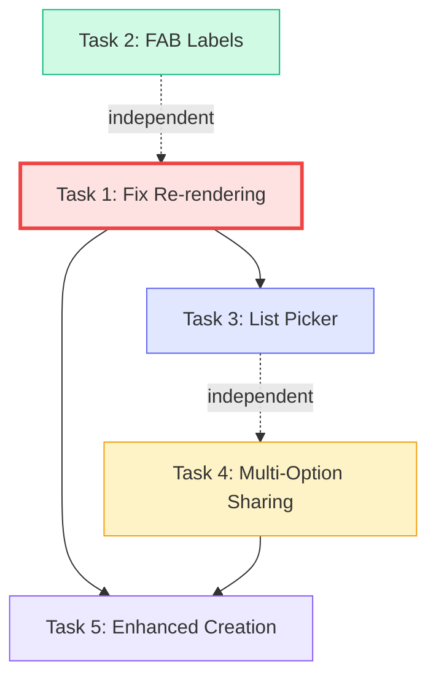

# Redesign Implementation Plan — Hebrew RTL PWA Shopping List

> **Generated:** 2026-04-12  
> **Project:** `d:/bazingalol123.github.io`  
> **Stack:** Vanilla JS ES Modules, Supabase backend, PWA  
> **Files analyzed:** `index.html`, `app.js`, `styles.css`, `components/render.js`, `components/ui.js`, `services/lists.js`, `services/items.js`, `store/state.js`, `store/elements.js`

---

## Table of Contents

1. [Task 1 — Fix Re-rendering After All CRUD Operations](#task-1--fix-re-rendering-after-all-crud-operations)
2. [Task 2 — Rename FAB Action Label](#task-2--rename-fab-action-label)
3. [Task 3 — Add List Picker in Header](#task-3--add-list-picker-in-header)
4. [Task 4 — Multi-Option Sharing](#task-4--multi-option-sharing)
5. [Task 5 — Enhanced List Creation Flow + Member Display](#task-5--enhanced-list-creation-flow--member-display)
6. [Dependency Graph](#dependency-graph)
7. [Risk Assessment](#risk-assessment)

---

## Task 1 — Fix Re-rendering After All CRUD Operations

**Priority:** HIGHEST

### Root Cause Analysis

After reading every handler, the app has a split re-render pattern:

| Operation | `state.items` updated? | `reRenderAll()` called? | `loadLists()` called? | `renderLists()` called? | Verdict |
|---|---|---|---|---|---|
| Create list | n/a | n/a | ✅ inside `createList()` | ✅ via `handleSwitchList()` | ✅ OK |
| Rename list | n/a | n/a | ✅ handler line 1077 | ✅ handler line 1078 | ✅ OK |
| Duplicate list | n/a | n/a | ✅ inside `duplicateList()` | ✅ via `handleSwitchList()` | ✅ OK |
| Delete list (current) | n/a | n/a | ✅ inside `deleteList()` | ✅ via `handleSwitchList()` | ✅ OK |
| **Delete list (non-current)** | n/a | n/a | ✅ inside `deleteList()` | ❌ `deleteList()` returns `undefined` when deleting non-current list, so `handleSwitchList` never fires | **❌ BROKEN** |
| **Clear completed** | ✅ optimistic | ✅ handler line 1112 | ❌ item counts on list cards stale | ❌ | **❌ STALE COUNTS** |
| **Add item** | ✅ optimistic | ✅ line 351 | ❌ | ❌ | **❌ STALE COUNTS** |
| **Quick-add item** | ✅ optimistic | ✅ line 397 | ❌ | ❌ | **❌ STALE COUNTS** |
| **Delete item** | ✅ optimistic | ✅ line 481 | ❌ | ❌ | **❌ STALE COUNTS** |
| **Edit item** | ✅ optimistic | ✅ via `optimisticSet()` | ❌ | ❌ | **❌ STALE COUNTS** |
| Group delete | ✅ `reRenderAll()` | ✅ line 774 | ❌ | ❌ | ⚠️ items OK, list counts stale |

### Key Insight

The items list renders correctly via optimistic updates + `reRenderAll()`. The **real bug** is that list cards on the Home tab show **stale `itemCount`** values because `loadLists()` + `renderLists()` are not called after item mutations. Additionally, deleting a non-current list leaves the card visible on the home screen.

### Solution: Create a Helper Function + Add Calls

#### Step 1.1 — Add `refreshListCards()` helper in `app.js`

**File:** [`app.js`](app.js:249)  
**Location:** After `reRenderAll()` function definition (line 253)

```js
/** Refresh list card UI after item count changes */
async function refreshListCards() {
  await loadLists();
  renderLists(handleSwitchList, handleOpenListActions);
}
```

#### Step 1.2 — Fix `handleAddItem` in `app.js`

**File:** [`app.js`](app.js:362)  
**Lines 362-366:** After `silentRefresh()` succeeds, add:

```js
// After line 365: silentRefresh();
refreshListCards(); // fire-and-forget to update home tab counts
```

#### Step 1.3 — Fix `handleQuickAddItem` in `app.js`

**File:** [`app.js`](app.js:401)  
**Lines 401-405:** After `silentRefresh()` succeeds, add:

```js
// After line 403: silentRefresh();
refreshListCards();
```

#### Step 1.4 — Fix `handleDeleteItem` in `app.js`

**File:** [`app.js`](app.js:484)  
**Lines 484-487:** After successful delete, add:

```js
// After line 486: setSyncChip('נמחק', 'connected');
refreshListCards();
```

#### Step 1.5 — Fix `handleSaveEditedItem` in `app.js`

**File:** [`app.js`](app.js:453)  
**Lines 453-456:** No list count change on edit, so no action needed. ✅ Already OK.

#### Step 1.6 — Fix `listActionClear` handler in `app.js`

**File:** [`app.js`](app.js:1108)  
**Lines 1108-1112:**

```js
els.listActionClear?.addEventListener('click', async () => {
  els.listActionsDialog.close();
  await clearCompleted(listActionsContext.listId);
  reRenderAll();
  await refreshListCards(); // <-- ADD THIS
});
```

#### Step 1.7 — Fix `listActionDelete` handler for non-current list deletion

**File:** [`app.js`](app.js:1114)  
**Lines 1114-1120:**

```js
els.listActionDelete?.addEventListener('click', async () => {
  const confirmed = await showConfirmDialog('מחיקת רשימה', `...`);
  if (!confirmed) return;
  els.listActionsDialog.close();
  const newListId = await deleteList(listActionsContext.listId);
  if (newListId) {
    await handleSwitchList(newListId);
  } else {
    // Non-current list was deleted — just refresh list cards
    renderLists(handleSwitchList, handleOpenListActions); // <-- ADD THIS
  }
});
```

### Files to Modify

| File | Changes |
|---|---|
| [`app.js`](app.js) | Add `refreshListCards()` helper; patch 5 handlers |

### HTML/CSS Changes

None.

---

## Task 2 — Rename FAB Action Label

**Priority:** Low (quick fix)

### Current State

**File:** [`index.html`](index.html:336)  
```html
<span class="fab-label">הוספה ידנית</span>
```

**File:** [`index.html`](index.html:342)  
```html
<span class="fab-label">סריקת קוד QR</span>
```

The QR scan FAB action (`#fabScanQr`) triggers `startQrScanner()` in [`app.js`](app.js:1057) which opens the QR scanner dialog for **joining a list** — not scanning products. The label is misleading.

### Changes

#### Step 2.1 — Rename "הוספה ידנית" → "הוסף פריט"

**File:** [`index.html`](index.html:336)  
**Line 336:** Change the `<span>` text and the `title` attribute on the button:

```html
<div class="fab-action-wrapper">
  <span class="fab-label">הוסף פריט</span>
  <button class="fab-action" id="fabAddManual" title="הוסף פריט">
    <span class="fab-action-icon">✏️</span>
  </button>
</div>
```

#### Step 2.2 — Relabel QR scan action to clarify it joins lists

**File:** [`index.html`](index.html:341)  
**Lines 341-345:**

```html
<div class="fab-action-wrapper">
  <span class="fab-label">הצטרפות לרשימה</span>
  <button class="fab-action" id="fabScanQr" title="הצטרפות עם קוד QR">
    <span class="fab-action-icon">🔗</span>
  </button>
</div>
```

> **Design decision:** The icon changes from 📷 to 🔗 to reinforce that this is a join/invite action, not a product scanner. The product barcode scanner is already inside the Add Item dialog (`#scanBarcodeBtn`).

### Files to Modify

| File | Changes |
|---|---|
| [`index.html`](index.html) | Two label text changes + one icon change |

### HTML/CSS/JS Changes

- **HTML:** Label text + title attr + icon emoji (lines 336-345)
- **CSS:** None
- **JS:** None

---

## Task 3 — Add List Picker in Header

**Priority:** Medium

### Current State

[`#currentListName`](index.html:209) is a `<p>` element inside the app header that displays the current list name as static text. Users must go to the Home tab to switch lists.

### Design

A clickable header that opens a bottom-sheet list picker dialog:

```
┌──────────────────────────┐
│ רשימת קניות משותפת        │
│ 🛒 קניות לשבת ▾           │  ← clickable, opens picker
└──────────────────────────┘
```

### Implementation

#### Step 3.1 — Make `#currentListName` clickable with dropdown indicator

**File:** [`index.html`](index.html:209)  
**Line 209:** Replace the `<p>` with:

```html
<button id="currentListName" class="list-picker-trigger muted" style="margin: 4px 0 0;" aria-haspopup="dialog">
  <span id="currentListNameText"></span>
  <span class="list-picker-arrow">▾</span>
</button>
```

#### Step 3.2 — Add list picker bottom-sheet dialog

**File:** [`index.html`](index.html:792) — after the `#showQrDialog` closing tag  
Add new dialog:

```html
<dialog id="listPickerDialog" class="app-dialog" aria-labelledby="listPickerTitle">
  <div class="dialog-content">
    <h3 id="listPickerTitle">בחר רשימה</h3>
    <p class="muted">עבור לרשימה אחרת</p>
    <div id="listPickerContainer" class="list-picker-list"></div>
    <div class="dialog-actions">
      <button type="button" id="closeListPickerBtn" class="btn-secondary">סגירה</button>
    </div>
  </div>
</dialog>
```

#### Step 3.3 — Add CSS for list picker

**File:** [`styles.css`](styles.css) — append after line 1012 (list actions menu section)

```css
/* ── List Picker Trigger ── */
.list-picker-trigger {
  display: inline-flex;
  align-items: center;
  gap: 6px;
  background: transparent;
  border: none;
  cursor: pointer;
  font-family: inherit;
  font-size: 0.85rem;
  font-weight: 500;
  color: var(--text-muted);
  padding: 4px 8px;
  border-radius: var(--radius-sm);
  transition: var(--transition);
}
.list-picker-trigger:hover,
.list-picker-trigger:active {
  background: var(--bg-2);
  color: var(--primary);
}
.list-picker-arrow {
  font-size: 0.7rem;
  opacity: 0.6;
}

/* ── List Picker Dialog ── */
.list-picker-list {
  display: flex;
  flex-direction: column;
  gap: 8px;
  max-height: 50vh;
  overflow-y: auto;
  margin: 16px 0;
}
.list-picker-item {
  display: flex;
  align-items: center;
  justify-content: space-between;
  padding: 14px 16px;
  background: var(--bg-2);
  border: 1px solid var(--line);
  border-radius: var(--radius-lg);
  cursor: pointer;
  transition: var(--transition);
  text-align: right;
  width: 100%;
  font-family: inherit;
}
.list-picker-item:hover {
  background: var(--primary-soft);
  border-color: var(--primary);
}
.list-picker-item.active {
  border-color: var(--primary);
  background: var(--primary-soft);
}
.list-picker-item-name {
  font-weight: 700;
  font-size: 1rem;
  color: var(--text);
}
.list-picker-item-count {
  font-size: 0.85rem;
  color: var(--text-muted);
  font-weight: 500;
}
```

#### Step 3.4 — Add JS logic in `app.js`

**File:** [`app.js`](app.js)

**A) Update `renderLists` call sites** — the `currentListName` element is now a `<button>` with a child `<span id="currentListNameText">`. Update [`components/render.js`](components/render.js:335) line 335:

```js
// Change from:
els.currentListName.textContent = currentList ? currentList.name : '';
// To:
const nameTextEl = document.getElementById('currentListNameText');
if (nameTextEl) {
  nameTextEl.textContent = currentList ? currentList.name : '';
} else if (els.currentListName) {
  els.currentListName.textContent = currentList ? currentList.name : '';
}
```

**B) Add list picker open/populate logic in `bindEvents()`** — in [`app.js`](app.js:521) inside `bindEvents()`:

```js
// List picker from header
els.currentListName?.addEventListener('click', () => {
  const dialog = document.getElementById('listPickerDialog');
  const container = document.getElementById('listPickerContainer');
  if (!dialog || !container) return;
  
  container.innerHTML = '';
  state.lists.forEach(list => {
    const isActive = list.id == state.currentListId;
    const btn = document.createElement('button');
    btn.type = 'button';
    btn.className = `list-picker-item${isActive ? ' active' : ''}`;
    btn.innerHTML = `
      <span class="list-picker-item-name">${escapeHtml(list.name)}</span>
      <span class="list-picker-item-count">${list.itemCount || 0} פריטים</span>
    `;
    btn.addEventListener('click', () => {
      dialog.close();
      handleSwitchList(list.id);
    });
    container.appendChild(btn);
  });
  
  dialog.showModal();
});

document.getElementById('closeListPickerBtn')?.addEventListener('click', () => {
  document.getElementById('listPickerDialog')?.close();
});
```

**C) Register new element in [`store/elements.js`](store/elements.js)** — no strict need since we use `document.getElementById` inline, but for consistency, add:

```js
listPickerDialog: document.getElementById('listPickerDialog'),
```

### Files to Modify

| File | Changes |
|---|---|
| [`index.html`](index.html) | Replace `<p>` with `<button>`, add `#listPickerDialog` |
| [`styles.css`](styles.css) | Add list picker trigger + dialog styles |
| [`app.js`](app.js) | Add click handler for `#currentListName`, populate + handle picker |
| [`components/render.js`](components/render.js) | Update line 335 to set text on `#currentListNameText` child span |
| [`store/elements.js`](store/elements.js) | Optional: add `listPickerDialog` |

---

## Task 4 — Multi-Option Sharing

**Priority:** Medium-High

### Current State

- [`generateInviteQr()`](services/lists.js:228) in `services/lists.js` **already returns the invite URL** as a string.
- The share handler at [`app.js`](app.js:1089) line 1089-1104 receives the URL, generates a QR code, and shows `#showQrDialog`.
- [`#showQrDialog`](index.html:783) only has a QR container and a close button.

### Design

Replace the QR-only dialog with a multi-option share sheet:

```
┌───────────────────────────────┐
│       שיתוף רשימה              │
│  הזמן אנשים להצטרף לרשימה      │
│                               │
│  ┌─────────┐  ┌────────────┐  │
│  │ 📋 העתק │  │ 📱 WhatsApp│  │
│  │  קישור   │  │            │  │
│  └─────────┘  └────────────┘  │
│  ┌─────────┐  ┌────────────┐  │
│  │ 📤 שתף  │  │ 📷 QR Code │  │
│  │  (מקורי) │  │            │  │
│  └─────────┘  └────────────┘  │
│                               │
│  [QR code shown here if       │
│   user clicks QR option]      │
│                               │
│         [ סגירה ]              │
└───────────────────────────────┘
```

### Implementation

#### Step 4.1 — Redesign `#showQrDialog` HTML

**File:** [`index.html`](index.html:783)  
**Lines 783-792:** Replace entire dialog content:

```html
<dialog id="shareDialog" class="app-dialog" aria-labelledby="shareDialogTitle">
  <div class="dialog-content" style="text-align: center;">
    <h3 id="shareDialogTitle">שיתוף רשימה</h3>
    <p class="muted">הזמינו אנשים להצטרף לרשימה הזו</p>
    
    <div class="share-options-grid">
      <button type="button" id="shareCopyLink" class="share-option-btn">
        <span class="share-option-icon">📋</span>
        <span class="share-option-label">העתק קישור</span>
      </button>
      <button type="button" id="shareWhatsApp" class="share-option-btn">
        <span class="share-option-icon">💬</span>
        <span class="share-option-label">WhatsApp</span>
      </button>
      <button type="button" id="shareNative" class="share-option-btn">
        <span class="share-option-icon">📤</span>
        <span class="share-option-label">שיתוף</span>
      </button>
      <button type="button" id="shareShowQr" class="share-option-btn">
        <span class="share-option-icon">📷</span>
        <span class="share-option-label">QR Code</span>
      </button>
    </div>

    <div id="shareQrContainer" style="display: none; margin-top: 16px;">
      <div id="shareQrCode" style="display: inline-block; background: white; padding: 16px; border-radius: var(--radius-lg);"></div>
    </div>
    
    <div id="shareCopiedFeedback" class="share-copied-feedback" style="display: none;">
      ✅ הקישור הועתק!
    </div>

    <div class="dialog-actions">
      <button type="button" id="closeShareDialogBtn" class="btn-secondary">סגירה</button>
    </div>
  </div>
</dialog>
```

> **Note:** The old `#showQrDialog` is replaced by `#shareDialog`. All references to `showQrDialog` / `showQrContainer` / `closeShowQrBtn` must be updated.

#### Step 4.2 — Add CSS for share options grid

**File:** [`styles.css`](styles.css) — append after dialog styles section

```css
/* ── Share Dialog ── */
.share-options-grid {
  display: grid;
  grid-template-columns: 1fr 1fr;
  gap: 12px;
  margin: 20px 0;
}
.share-option-btn {
  display: flex;
  flex-direction: column;
  align-items: center;
  gap: 8px;
  padding: 20px 12px;
  background: var(--bg-2);
  border: 1px solid var(--line);
  border-radius: var(--radius-lg);
  cursor: pointer;
  transition: var(--transition);
  font-family: inherit;
}
.share-option-btn:hover {
  background: var(--primary-soft);
  border-color: var(--primary);
}
.share-option-btn:active {
  transform: scale(0.95);
}
.share-option-icon {
  font-size: 1.8rem;
}
.share-option-label {
  font-size: 0.9rem;
  font-weight: 700;
  color: var(--text);
}
.share-copied-feedback {
  padding: 10px;
  background: var(--success-soft);
  color: var(--success);
  border-radius: var(--radius-lg);
  font-weight: 700;
  font-size: 0.9rem;
  margin-top: 12px;
  animation: fadeIn 0.3s ease;
}
```

#### Step 4.3 — Update element references

**File:** [`store/elements.js`](store/elements.js:16)  
**Lines 16-18:** Replace old QR dialog references:

```js
// Remove:
showQrDialog: document.getElementById('showQrDialog'),
showQrContainer: document.getElementById('showQrContainer'),
closeShowQrBtn: document.getElementById('closeShowQrBtn'),

// Add:
shareDialog: document.getElementById('shareDialog'),
shareQrCode: document.getElementById('shareQrCode'),
shareQrContainer: document.getElementById('shareQrContainer'),
closeShareDialogBtn: document.getElementById('closeShareDialogBtn'),
```

#### Step 4.4 — Rewrite share handler in `app.js`

**File:** [`app.js`](app.js:1089)  
**Lines 1089-1106:** Replace entire `listActionShareQr` handler and `closeShowQrBtn` handler:

```js
// Store invite URL for share dialog
let currentShareUrl = '';

els.listActionShareQr?.addEventListener('click', async () => {
  els.listActionsDialog.close();
  const inviteUrl = await generateInviteQr(listActionsContext.listId);
  if (!inviteUrl) return;
  
  currentShareUrl = inviteUrl;
  
  // Reset QR container visibility
  const qrContainer = document.getElementById('shareQrContainer');
  if (qrContainer) qrContainer.style.display = 'none';
  
  // Hide native share button if API not available
  const nativeBtn = document.getElementById('shareNative');
  if (nativeBtn) {
    nativeBtn.style.display = navigator.share ? 'flex' : 'none';
  }
  
  document.getElementById('shareDialog')?.showModal();
});

// Copy Link
document.getElementById('shareCopyLink')?.addEventListener('click', async () => {
  try {
    await navigator.clipboard.writeText(currentShareUrl);
    const feedback = document.getElementById('shareCopiedFeedback');
    if (feedback) {
      feedback.style.display = 'block';
      setTimeout(() => { feedback.style.display = 'none'; }, 2000);
    }
  } catch {
    // Fallback for older browsers
    const ta = document.createElement('textarea');
    ta.value = currentShareUrl;
    document.body.appendChild(ta);
    ta.select();
    document.execCommand('copy');
    ta.remove();
    showMessage('הקישור הועתק!');
  }
});

// WhatsApp
document.getElementById('shareWhatsApp')?.addEventListener('click', () => {
  const listName = listActionsContext.listName || 'רשימת קניות';
  const text = `הצטרפו לרשימת הקניות "${listName}" שלי! 🛒\n${currentShareUrl}`;
  window.open(`https://wa.me/?text=${encodeURIComponent(text)}`, '_blank');
});

// Native Share API
document.getElementById('shareNative')?.addEventListener('click', async () => {
  try {
    const listName = listActionsContext.listName || 'רשימת קניות';
    await navigator.share({
      title: `הצטרפו ל${listName}`,
      text: `הצטרפו לרשימת הקניות "${listName}" שלי! 🛒`,
      url: currentShareUrl
    });
  } catch (err) {
    if (err.name !== 'AbortError') {
      showMessage('שגיאה בשיתוף', true);
    }
  }
});

// Show QR Code
document.getElementById('shareShowQr')?.addEventListener('click', () => {
  const qrContainer = document.getElementById('shareQrContainer');
  const qrCode = document.getElementById('shareQrCode');
  if (!qrContainer || !qrCode) return;
  
  qrCode.innerHTML = '';
  new QRCode(qrCode, {
    text: currentShareUrl,
    width: 200,
    height: 200,
    colorDark: '#000000',
    colorLight: '#ffffff',
    correctLevel: QRCode.CorrectLevel.M
  });
  qrContainer.style.display = 'block';
});

// Close share dialog
document.getElementById('closeShareDialogBtn')?.addEventListener('click', () => {
  document.getElementById('shareDialog')?.close();
});
```

#### Step 4.5 — Expose `openShareDialog()` for Task 5 reuse

**File:** [`app.js`](app.js)

Extract the share dialog open logic into a reusable function:

```js
async function openShareDialog(listId, listName) {
  const inviteUrl = await generateInviteQr(listId);
  if (!inviteUrl) return;
  
  currentShareUrl = inviteUrl;
  listActionsContext.listName = listName;
  
  const qrContainer = document.getElementById('shareQrContainer');
  if (qrContainer) qrContainer.style.display = 'none';
  
  const nativeBtn = document.getElementById('shareNative');
  if (nativeBtn) nativeBtn.style.display = navigator.share ? 'flex' : 'none';
  
  document.getElementById('shareDialog')?.showModal();
}
```

Then the `listActionShareQr` handler becomes:

```js
els.listActionShareQr?.addEventListener('click', async () => {
  els.listActionsDialog.close();
  await openShareDialog(listActionsContext.listId, listActionsContext.listName);
});
```

#### Step 4.6 — Update list actions button label

**File:** [`index.html`](index.html:761)  
**Line 761-764:** Change the label from QR-specific to general sharing:

```html
<button id="listActionShareQr" class="list-action-btn">
  <span class="action-icon">📤</span>
  <span>שתף רשימה</span>
</button>
```

### Files to Modify

| File | Changes |
|---|---|
| [`index.html`](index.html) | Replace `#showQrDialog` with `#shareDialog`, update share button label |
| [`styles.css`](styles.css) | Add `.share-options-grid`, `.share-option-btn`, `.share-copied-feedback` |
| [`app.js`](app.js) | Rewrite share handler, add `openShareDialog()`, add Copy/WhatsApp/Native/QR handlers |
| [`store/elements.js`](store/elements.js) | Replace old QR refs with new share dialog refs |

---

## Task 5 — Enhanced List Creation Flow + Member Display

**Priority:** Medium

### Current State

- [`#newListDialog`](index.html:718) exists in HTML with name input + type radio buttons (shopping/event) but is **completely unused**.
- [`handleCreateNewList`](app.js:950) at line 950 uses `showPromptDialog()` (a generic prompt) instead of the proper dialog.
- [`createList()`](services/lists.js:52) in `services/lists.js` accepts only `name`, no `type` field.
- [`renderLists()`](components/render.js:279) in `components/render.js` shows list name + item count, no member info.
- [`getListMembers()`](services/lists.js:381) exists in `services/lists.js` but is only used for responsibility groups.

### Sub-task 5A — Wire Up `#newListDialog`

#### Step 5A.1 — Register new dialog elements

**File:** [`store/elements.js`](store/elements.js)

Add to `els`:

```js
newListDialog: document.getElementById('newListDialog'),
newListName: document.getElementById('newListName'),
newListDialogOk: document.getElementById('newListDialogOk'),
newListDialogCancel: document.getElementById('newListDialogCancel'),
```

#### Step 5A.2 — Replace `handleCreateNewList` in `app.js`

**File:** [`app.js`](app.js:950)  
**Lines 950-981:** Replace the entire `handleCreateNewList` function:

```js
const handleCreateNewList = async () => {
  // Open the proper new list dialog instead of prompt
  const dialog = document.getElementById('newListDialog');
  const nameInput = document.getElementById('newListName');
  if (!dialog || !nameInput) return;
  
  nameInput.value = '';
  // Reset radio to shopping
  const shoppingRadio = dialog.querySelector('input[name="newListType"][value="shopping"]');
  if (shoppingRadio) shoppingRadio.checked = true;
  
  dialog.showModal();
  nameInput.focus();
};
```

#### Step 5A.3 — Add dialog submit handler in `bindEvents()`

**File:** [`app.js`](app.js) — inside `bindEvents()`:

```js
// New List Dialog handlers
document.getElementById('newListDialogOk')?.addEventListener('click', async () => {
  const nameInput = document.getElementById('newListName');
  const name = nameInput?.value.trim();
  if (!name) {
    showMessage('נא להזין שם לרשימה.', true);
    return;
  }
  
  const typeRadio = document.querySelector('input[name="newListType"]:checked');
  const listType = typeRadio?.value || 'shopping';
  
  document.getElementById('newListDialog')?.close();
  
  const newListId = await createList(name, listType);
  if (newListId) {
    await handleSwitchList(newListId);
    
    // Post-creation share prompt (Sub-task 5B)
    const wantToShare = await showConfirmDialog(
      'הזמן אנשים 👥',
      'רוצה להזמין אנשים לקנות ביחד?'
    );
    if (wantToShare) {
      const currentList = state.lists.find(l => l.id === newListId);
      await openShareDialog(newListId, currentList?.name || name);
    }
  }
});

document.getElementById('newListDialogCancel')?.addEventListener('click', () => {
  document.getElementById('newListDialog')?.close();
});
```

#### Step 5A.4 — Add `type` parameter to `createList()`

**File:** [`services/lists.js`](services/lists.js:52)  
**Line 52:** Update function signature and insert:

```js
export async function createList(name, type = 'shopping') {
  // ... existing code ...
  const { error } = await sb
    .from('lists')
    .insert({ id: newListId, name, created_by: user.id, type });
  // ... rest unchanged ...
}
```

> **⚠️ DB Schema Note:** The `lists` table likely needs a `type` column added. If the column does not exist, the insert will fail silently or error. Add to the Supabase `lists` table:
> ```sql
> ALTER TABLE lists ADD COLUMN type text DEFAULT 'shopping';
> ```

### Sub-task 5B — Post-Creation Share Prompt

Already included in Step 5A.3 above — after `createList` succeeds, a confirm dialog asks if the user wants to share. If yes, `openShareDialog()` (from Task 4) is called.

**Dependency:** This requires Task 4 to be completed first so `openShareDialog()` exists.

### Sub-task 5C — Member Display on List Cards

#### Step 5C.1 — Enhance `loadLists()` to include member data

**File:** [`services/lists.js`](services/lists.js:22)  
**Lines 22-45:** Update the query to include member profiles:

```js
export async function loadLists() {
  if (!currentUser) return;
  
  const { data, error } = await sb
    .from('lists')
    .select(`
      id, name, type, created_by,
      list_members!inner(user_id, profiles(display_name, avatar_emoji)),
      items(count)
    `)
    .order('created_at', { ascending: true });

  if (error) {
    showMessage('שגיאה בטעינת רשימות: ' + error.message, true);
    return;
  }

  state.lists = (data || []).map(l => ({
    id: l.id,
    name: l.name,
    type: l.type || 'shopping',
    itemCount: l.items?.[0]?.count ?? 0,
    members: (l.list_members || []).map(m => ({
      userId: m.user_id,
      displayName: m.profiles?.display_name || '',
      avatarEmoji: m.profiles?.avatar_emoji || '👤'
    }))
  }));
  
  if (!state.currentListId && state.lists.length > 0) {
    state.currentListId = state.lists[0].id;
  }
}
```

#### Step 5C.2 — Update `renderLists()` to show member avatars

**File:** [`components/render.js`](components/render.js:279)  
**Lines 299-331:** Update the card rendering inside the `state.lists.forEach` block:

```js
card.innerHTML = `
  <div style="display:flex; justify-content:space-between; align-items:flex-start;">
    <h4 style="margin:0; padding-top:4px;">
      ${list.type === 'event' ? '⛺' : '🛒'} ${escapeHtml(list.name)}
    </h4>
    <button class="list-more-btn" data-list-id="${list.id}" data-list-name="${escapeHtml(list.name)}">⋮</button>
  </div>
  <div class="list-meta">
    <span>${list.itemCount || 0} פריטים</span>
    ${isActive ? '<span style="color:var(--primary); font-size:12px; font-weight: 700;">★ נבחר</span>' : ''}
  </div>
  <div class="list-card-members">
    ${(list.members || []).slice(0, 4).map(m => 
      `<span class="list-member-avatar" title="${escapeHtml(m.displayName)}">${m.avatarEmoji}</span>`
    ).join('')}
    ${(list.members || []).length > 4 ? `<span class="list-member-more">+${list.members.length - 4}</span>` : ''}
    <button class="list-invite-btn" data-list-id="${list.id}" data-list-name="${escapeHtml(list.name)}">+ הזמן</button>
  </div>
`;
```

After setting up `moreBtn` handler, add invite button handler:

```js
const inviteBtn = card.querySelector('.list-invite-btn');
if (inviteBtn) {
  inviteBtn.addEventListener('click', async (e) => {
    e.stopPropagation();
    // Use openShareDialog from Task 4
    const shareEvent = new CustomEvent('openShare', { 
      detail: { listId: list.id, listName: list.name } 
    });
    document.dispatchEvent(shareEvent);
  });
}
```

Then in `app.js` `bindEvents()`, listen for this event:

```js
document.addEventListener('openShare', async (e) => {
  await openShareDialog(e.detail.listId, e.detail.listName);
});
```

#### Step 5C.3 — Add CSS for member avatars on list cards

**File:** [`styles.css`](styles.css) — append after `.home-list-card` styles (around line 416)

```css
/* ── List Card Members ── */
.list-card-members {
  display: flex;
  align-items: center;
  gap: 4px;
  flex-wrap: wrap;
  margin-top: 4px;
}
.list-member-avatar {
  font-size: 1.2rem;
  line-height: 1;
}
.list-member-more {
  font-size: 0.75rem;
  color: var(--text-muted);
  font-weight: 700;
  padding: 2px 6px;
  background: var(--bg-2);
  border-radius: var(--radius-pill);
}
.list-invite-btn {
  margin-inline-start: auto;
  padding: 4px 10px;
  font-size: 0.75rem;
  font-weight: 700;
  background: var(--primary-soft);
  color: var(--primary);
  border: none;
  border-radius: var(--radius-pill);
  cursor: pointer;
  transition: var(--transition);
  font-family: inherit;
}
.list-invite-btn:hover {
  background: var(--primary);
  color: white;
}
```

### Files to Modify

| File | Changes |
|---|---|
| [`index.html`](index.html) | No new HTML needed — `#newListDialog` already exists |
| [`styles.css`](styles.css) | Add `.list-card-members`, `.list-member-avatar`, `.list-invite-btn` |
| [`app.js`](app.js) | Replace `handleCreateNewList`, add dialog handlers, add share event listener |
| [`services/lists.js`](services/lists.js) | Add `type` param to `createList()`, enhance `loadLists()` query for members |
| [`components/render.js`](components/render.js) | Update card HTML to show type icon, member avatars, invite button |
| [`store/elements.js`](store/elements.js) | Add `newListDialog`, `newListName`, etc. |
| **Supabase DB** | `ALTER TABLE lists ADD COLUMN type text DEFAULT 'shopping';` |

---

## Dependency Graph



**Execution order:**
1. **Task 1** — Fix re-rendering (HIGHEST priority, no dependencies)
2. **Task 2** — FAB labels (independent, trivial)
3. **Task 4** — Multi-option sharing (independent, needed by Task 5)
4. **Task 3** — List picker in header (depends on Task 1 for accurate list data)
5. **Task 5** — Enhanced creation flow (depends on Task 4 for `openShareDialog()`)

---

## Risk Assessment

| Risk | Severity | Mitigation |
|---|---|---|
| **DB schema change for `type` column (Task 5)** | High | Run migration before deploying code. If column absent, `createList` will error. Add `type` with default `'shopping'` so existing rows are safe. |
| **Breaking `#showQrDialog` references (Task 4)** | Medium | Global search-replace for `showQrDialog` → `shareDialog`, `showQrContainer` → `shareQrCode`, `closeShowQrBtn` → `closeShareDialogBtn`. Check `store/elements.js`, `app.js`, `index.html`. |
| **`navigator.share()` not available on desktop (Task 4)** | Low | Already handled by feature-detecting and hiding the button: `nativeBtn.style.display = navigator.share ? 'flex' : 'none'`. |
| **`navigator.clipboard.writeText()` fails in insecure context (Task 4)** | Low | Fallback with textarea + `execCommand('copy')` already included. |
| **`currentListName` element type change from `<p>` to `<button>` (Task 3)** | Medium | `store/elements.js` caches this as `els.currentListName`. All code that sets `.textContent` on it must be updated to target the child `#currentListNameText` span instead. Only one location: `render.js` line 335. |
| **Excessive `loadLists()` calls degrading performance (Task 1)** | Low | `refreshListCards()` is fire-and-forget after item ops. The query is lightweight. Consider debouncing if users rapidly add items. |
| **Race conditions with optimistic UI + `refreshListCards()` (Task 1)** | Low | Item state comes from optimistic local updates; list card counts come from server. These are independent, no conflict. |
| **QRCode library not loaded when share dialog opens (Task 4)** | Low | The library is loaded with `defer` attribute. By the time user interacts, it will be loaded. Add a guard: `if (typeof QRCode === 'undefined') return;`. |
| **RTL layout for share options grid (Task 4)** | Low | CSS grid with `grid-template-columns: 1fr 1fr` is direction-agnostic. Test in RTL to confirm. |

---

## Summary of All File Changes

| File | Task 1 | Task 2 | Task 3 | Task 4 | Task 5 |
|---|---|---|---|---|---|
| [`index.html`](index.html) | — | ✏️ | ✏️ | ✏️ | — |
| [`app.js`](app.js) | ✏️ | — | ✏️ | ✏️ | ✏️ |
| [`styles.css`](styles.css) | — | — | ✏️ | ✏️ | ✏️ |
| [`components/render.js`](components/render.js) | — | — | ✏️ | — | ✏️ |
| [`components/ui.js`](components/ui.js) | — | — | — | — | — |
| [`services/lists.js`](services/lists.js) | — | — | — | — | ✏️ |
| [`services/items.js`](services/items.js) | — | — | — | — | — |
| [`store/elements.js`](store/elements.js) | — | — | ✏️ | ✏️ | ✏️ |
| [`store/state.js`](store/state.js) | — | — | — | — | — |
| **Supabase DB** | — | — | — | — | ✏️ |
